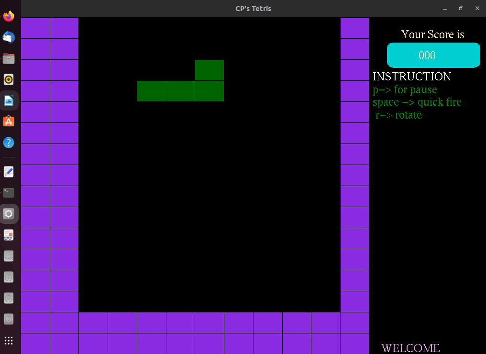
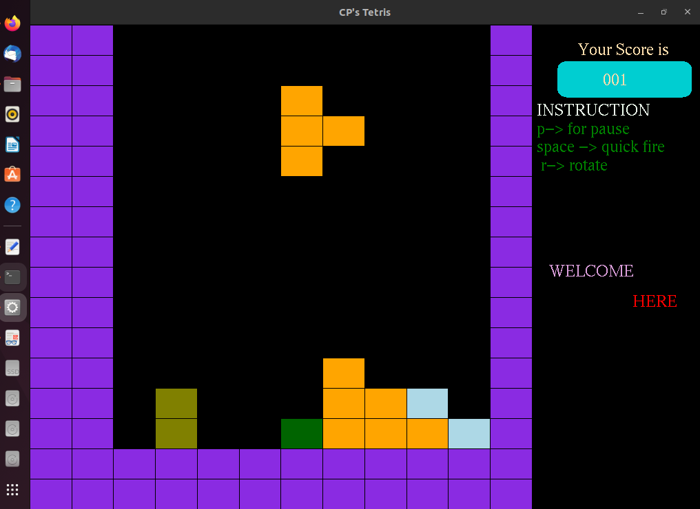

# Tetris Game

A C++ based implementation of classic tetris game.


## Table of Contents

- [Requirements](#requirements)
- [Installations](#installations)
- [Usage](#usage)
- [Screenshots](#screenshots)
- [Acknowledgements](#acknowledgements)


## Requirements

- C++
- Ubuntu


## Installations

To install the required libraries use the file install-libraries.sh using command line in ubuntu, simply run the terminal and go to the directory that contains the downloaded code and run the command below:


```
$ bash install-libraries.sh
```

If this command gives error that libglew1.6-dev can't not be found, try older version of libraries, such as libglew1.5-dev by the command below,

```
$ sudo apt-get install libglew1.5-dev

```

If there are stil some errors, then follow similar procedure to install “OpenGL” libraries online for your setup.


## Usage


Once all the requirements are installed successfully, run the following command to start plyaing the game.


```
$ make
$ ./game-release
```


## Screenshots

Here are some screenshots how this game is working...






## Acknowledgement

This code was written by me in my bachlors degree as a project of Computer Programming course in National University of Computer and Emerging Sciences. Some of the code was written by our Professor Sibt-ul-Hussain as it is mentioned in the starting of each file.
